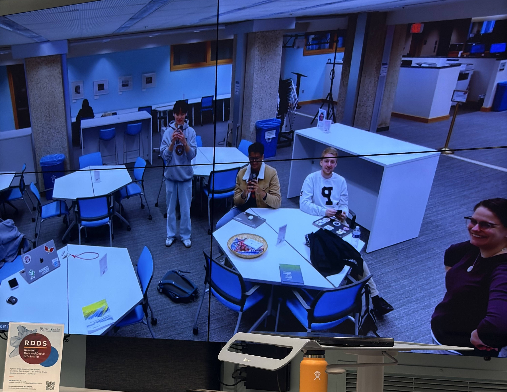
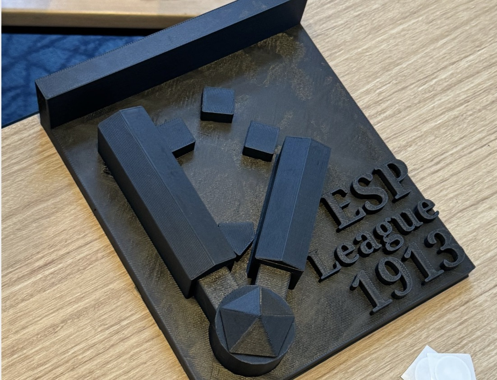

‎ ‎ ‎ ‎ ‎ ‎ ‎ ‎ ‎ ‎
## Final Statement 
Throughout this semester, my understanding of digital humanities underwent a significant transformation. When I enrolled in this course, I brought with me a set of assumptions about the nature of data and its role in knowledge production, shaped by my background as a biochemistry major involved in laboratory research. In my scientific work, data is often viewed as an objective, quantitative resource to be mined for insights through standardized methods and statistical analysis. The digital tools we use in the lab, from gene sequencers to data visualization software, are viewed as neutral instruments that help us efficiently process and represent our findings. 

This scientific mindset led me to initially view digital humanities as simply applying computational tools to humanities questions, bringing the quantitative rigor of data science to qualitative fields like literature and history. However, over the course of the semester, the diverse perspectives and projects we engaged with challenged my assumptions about the nature of data, learning about the affordances of digital media, and  revealing a far more complex relationship between digital tools, human interpretation, and knowledge production than I had initially considered. 

The first major shift in my understanding came through examining the contexts, assumptions, and human processes behind the production and use of data in digital humanities. Readings like Dan Bouk's "Stories in the Data" and Katie Rawson and Trevor Muñoz's "Against Cleaning" emphasized how data is not neutral or self-evident, but rather shaped by the people and systems involved in its creation, selection, and interpretation. The "Python for Humanists" workshop offered concrete examples of both the potential and the pitfalls of using computational methods in digital humanities. While Python allowed us to analyze massive cultural datasets like historical newspaper archives, each decision about what to count, how to categorize, and what to ignore shaped the possible insights. These concrete examples helped me see how computational methods, rather than being neutral tools, actively participate in creating meaning. 

 

Learning about how tools shape knowledge led to my second major insight about how digital tools and platforms are not just means of representing existing knowledge, but actively shape what types of questions and insights are possible. Ruha Benjamin's lecture on “AI and Human Values” helped me see how social and political biases become embedded in digital systems, while projects like “Eastern Apps” and the “Digital Panopticon” demonstrated the ethical weight of these choices. When representing histories of incarceration, every digital design decision, from user interface to data structure, carries ethical implications about how we represent human lives and experiences.

This theme about the affordances of different mediums also came up in our class visits to the Kislak Center and SCETI imaging lab, where we saw how the processes of digitization involve complex translations of physical materials into digital assets. As Dot Porter argues in her reflections on digitizing medieval manuscripts, the digital surrogate is never a perfect stand-in for the physical artifact, but a new kind of object with its own affordances and limitations. Drawing on the concept of the "uncanny valley" from robotics, Porter suggests that as digital representations become more "manuscript-like," our affinity for them increases until they seem eerily close to the real thing, but still somehow "off." The irreproducible "ghost" of the physical manuscript, she contends, can never be fully captured by even the most high-fidelity digital "machine."

Watching the technicians carefully photograph and scan the fragile pages of centuries-old books, I was struck by the simultaneous immediacy and distance of the digital images they produced. On the one hand, the high-resolution scans allowed me to zoom in on minute details of the text and illustrations that would be difficult to see with the naked eye. On the other hand, I was acutely aware of all the sensory and contextual information that was being left out of the frame: the texture of the parchment, the weight of the binding, and the musty smell of the archive. I could also see how the act of digitization was not just a process of documentation but of transformation and interpretation. The technicians had to make countless decisions about how to light and frame each page, how to calibrate the color profiles and stitch together the scanned fragments, and how to tag and categorize the images for storage and retrieval. All of these small choices shape what kinds of questions and insights the digitized manuscripts make possible and what kinds of knowledge they may hide.

All these ideas were important when working in the Education Commons on the critical-making project, where our group had to thoughtfully match the affordances and constraints of NFC technology with our goals of connecting users to the stories of baseball at Eastern State Penitentiary in an interactive way. Creating a 3D model of the historic site allowed us to place the NFC tags in spatially and thematically meaningful locations, inviting users to uncover a narrative as they moved through the space. At the same time, the process of fabrication involved tradeoffs and mistranslations between the digital model and physical object. Through this project, I experienced firsthand the challenges of the digital humanities, learning how to harness digital technologies in ways that enrich rather than oversimplify complex human stories.

 

In reflecting on what I have learned during this semester, I now understand that this field is much more complex than simply applying computational tools to humanities research. My initial perspective as a biochemistry student led me to view data and digital tools as neutral, objective instruments for knowledge production. However, through our readings, discussions, and hands-on experiences like visiting the SCETI imaging lab and working on our critical-making project at the Education Commons, I've developed a more nuanced understanding of how digital humanities operates at the intersection of technology, interpretation, and human experience. This deeper understanding of digital humanities has not only changed my perspective on how technology shapes knowledge production but also made me more aware of the contexts, assumptions, and human processes that shape all forms of scholarly inquiry.

[Return to homepage](README.md)
